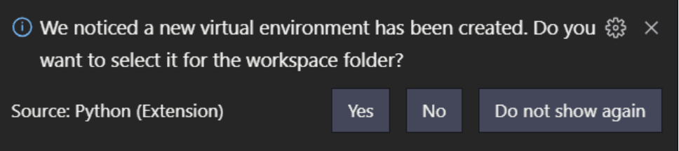
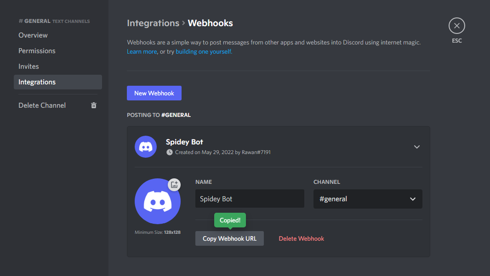

# 👥 Attendo
#### Attendo is an attendance system works on the principle of face - recognition built under Microsoft Engage Mentorship Program 2022.


# Approach Towards Building the Project
### Development Methodology - Scrum Methodology
**Agile Scrum Methodology** is basically incremental development i.e. we build the product in iterations, step by step. <br><br>
We work in “Sprints” where each sprint lasts for a week or two, and focus on building the important features first and then improve the product to make it more potential.

### Here are the sprints I had set for myself for the 4 week journey 😄

#### WEEK 0 ( INITIAL DAYS )
1. **Learning** more about Backend Development
2. **Researching** about different api for detecting faces
3. **Deciding the Tech Stack** and finding suitable resources
4. **Designing** my product (using [Canva](https://www.canva.com/) and [Figma](https://www.figma.com/) )

#### WEEK 1 ( BUILD PHASE )
1. Started with developing the **HomePage** and adjusting the camera position.
2. Developed the **Login** interface for both admins and normal user.
3. Developed the **Flask** backend part for recognizing the **face** and give back its **details(Encodings)**
4. Started working on the **Node** for developing auth.
<br>

**ISSUES :**
Recognizing Faces in real time **( not implemented as of now, But sure of doing it in near future )**


#### WEEK 2 ( BUILD PHASE )
1. Working on the **Authentication** 
2. Working on making the site **responsive**
3. Working on UI/UX and improving its functionality
<br>


#### WEEK 3 ( Winding Up)
1. Deploying
2. Completing integration of backend and frontend services
3. Taking feedback from mentors and other users
<br>

## Before You Begin
Before you begin we recommend you read about the basic building blocks that assemble my engage project:
* MongoDB - Go through [MongoDB Official Website](http://mongodb.org/) and proceed to their [Official Manual](http://docs.mongodb.org/manual/), which should help you understand NoSQL and MongoDB better.
* Express - The best way to understand express is through its [Official Website](http://expressjs.com/), which has a [Getting Started](http://expressjs.com/starter/installing.html) guide, as well as an [ExpressJS](http://expressjs.com/en/guide/routing.html) guide for general express topics. You can also go through this [StackOverflow Thread](http://stackoverflow.com/questions/8144214/learning-express-for-node-js) for more resources.
* Node.js - Start by going through [Node.js Official Website](http://nodejs.org/) and this [StackOverflow Thread](http://stackoverflow.com/questions/2353818/how-do-i-get-started-with-node-js), which should get you going with the Node.js platform in no time.
* React.js - A JavaScript library for building user interfaces build by Facebook. Go through [React official website](https://reactjs.org/) and proceed to their [documntations](https://reactjs.org/docs/getting-started.html) and [tutorials](https://reactjs.org/tutorial/tutorial.html), which should help you understand the React Framework easily.
* Flask - Begin ypur journey to understand Flask by going through the [Official Manual](https://flask.palletsprojects.com/en/2.1.x/quickstart/) and [Tutorials](https://flask.palletsprojects.com/en/2.1.x/tutorial/) to get the basic understanding of the Flask framework

## Prerequisites
Make sure you have installed all of the following prerequisites on your development machine:
* Git - [Download & Install Git](https://git-scm.com/downloads). OSX and Linux machines typically have this already installed.
* VS Code - [Download & Install VS Code](https://code.visualstudio.com/download), one of the most popular code - editor developed by Microsoft.
* Node.js - [Download & Install Node.js](https://nodejs.org/en/download/) and the npm package manager. If you encounter any problems, you can also use this [GitHub Gist](https://gist.github.com/isaacs/579814) to install Node.js.
* MongoDB - [Download & Install MongoDB](http://www.mongodb.org/downloads), and make sure it's running on the default port (27017).
* Python - [Download & Install Python](https://www.python.org/downloads/), and the pip package manager. 


## Downloading the Engage - Project
There are several ways you can get the Engage - Project boilerplate:

### Cloning The GitHub Repository
The recommended way to get the Engage - Project is to use git to directly clone the Engae - Project repository:

1. Fork the repository to your own account.
2. Run the following command in the terminal to clone the repository

```bash
$ git clone https://github.com/<Your-Github-Name >/Engage-Project.git 
```


### Downloading The Repository Zip File
Another way to use the Engage - Project boilerplate is to download a zip copy from the [main branch on GitHub](https://github.com/Devansh-gaur-1611/Engage-Project) and click on the Code button and then click on Download ZIP


# Get Started
Once you've downloaded the boilerplate and installed all the prerequisites, you're just a few steps away from starting to run my Engage - project


## Get started with Frontend

- Open the Frontend folder (Engage Project/frontend/face-recognition) and open the folder in VS Code.

- Open a new terminal by clicking the command (Ctrl + Shift + `) or clicking on  Terminal : New Terminal in the nav-menu

- To install the dependencies, run this in the application folder from the command-line:
    ```bash
    $ npm install
    ```

- Create a .env file in the current directory of the project using the touch command in your terminal
    ```bash
    touch .env
    ```

- Get the .env variables name from the .env.example file and paste them in .env file

- To get the backend urls, we have to first start our backend and then just paste their localhost URL as shown below

    ```bash
    REACT_APP_NODE_API_URL = <Your localhost node url>
    REACT_APP_FLASK_API_URL = <Your localhost flask url>
    ```

- To get the firebase credentials, go to [Firebase](https://firebase.google.com/), create your account, create a new project. Here, you can get your firebase credentials. Also, start the storage functionality of Firebase. Make sure to start in development mode(while starting the Firebase Storage).

- Remember to paste all the values into the .env file

- To run the react - app, run the following command
     ```bash
    $ npm start
    ```
- The server will listen on PORT 3000 ( localhost:3000 )


## Get all Backend Api's
- For our Flask Backend Api's go to postman and import via Link
     ```bash
     https://www.getpostman.com/collections/0132b47ac294f4383346
    ```
- For our Node Backend Api's go to postman and import via Link
     ```bash
     https://www.getpostman.com/collections/05ac03a1c3957e6730e8
    ```

## Get started with Backend(Flask)
- Our Flask Backend Url 
     ```bash
     https://face-recognition-flask-backend.herokuapp.com
    ```
- Open the Flask backend folder (Engage Project/backend/face-recognition-backend-flask) and open the folder in VS Code.

- Open the terminal and run the following command to create a virtual environment with namely ".venv"(in windows)
     ```bash
    $ python -m venv .venv
    ```
- A pop-up will populated in vs code as shown. Click "Yes" to activate virtual environment

    

- Run the command to install the dependencies
     ```bash
    $ pip install -r requirements.txt
    ```
- Run the command to run the flask backend locally
     ```bash
    $ flask run
    ```

## Get started with Backend(Node)
- Our Node Backend Url 
     ```bash
     https://attendo.cyclic.app/
    ```
- Open the Node backend folder (Engage Project/backend/face-recognition-backend-node) and open the folder in VS Code.

- Open the terminal and run the following command to install  dependencies
    ```bash
    $ npm i
    ```
- Create a .env file in the current directory of the project using the touch command in your terminal
    ```bash
    touch .env
    ```
- Get the .env variables name from the .env.example file

- For firebase credentials, use the method specified in the frontend part

- For MongoDb Database URL

    - You'll have to setup your mongoDB database for the project. For that create an account on MongoDB Atlas. Remember your credentials like Username & Password.

    - Create a database. In your database, click on "Connect". Here you will get the database url.

- jwt-secret & refresh-secret keys are just ramdom strings. You can choose them on your own.

- For redis-url, go to [Upstash](https://upstash.com/). Create an account and then create a database.Then you will get your redis url. You can also refer [Upstash Documentation](https://docs.upstash.com/redis) for help.

- For Mail Server Keys run the Golang backend Mail-server and use the server url , id , password according to you.

- For Discord Keys the open Desktop Discord and open channel edit settings, go to integrations create a Webhook , Copy webhook url and then copy hook id and hook token .
 
 From webhook Url copy id and token as shown below
 

- After getting all the environment variables, just run the following command to run: 
    ```bash
    $ npm start
    ```

## Get started with Backend(Golang)

- Open the Golang backend folder (Engage Project/backend/face-recognition-backend-MailServer) and open the folder in VS Code.

- Open the terminal and run the following command to install dependencies
    ```bash
    $ go mod tidy
    ```
- For Discord use the method Node backend Discord setup.
- For Sendgrid create a [Sendgrid](https://sendgrid.com/) account and create template with the help our template html files (Engage Project/backend/face-recognition-backend-MailServer/services/sendgrid/template) ,After this copy sendgrid apiurl and template id .
- For Security pupose we hardcoded adminId/password so create adminId password according to you.

- After getting all the environment variables, just run the following command to run: 
    ```bash
    $ go run .
    ```

## Future Enhancements planned for my Engage Project

### - Take constant feedbacks and suggestions from friends and family

### - Try to refine the features from ***"Improvement"*** point of view
1. *Marking attandance with the help of dept/team code instead of name*
2. *Participants can join the class using team-code*
3. *Add functionality of marking attendance based on IP address and locatiom*

### - Work on implementing the features planned earlier
1. *Making the face - recognition dynamic (i.e. can mark attendance as soon as it detect a face)*
2. *Mark attandance of more than one person at a time*
3. *Sending default password to the participant by mail*
